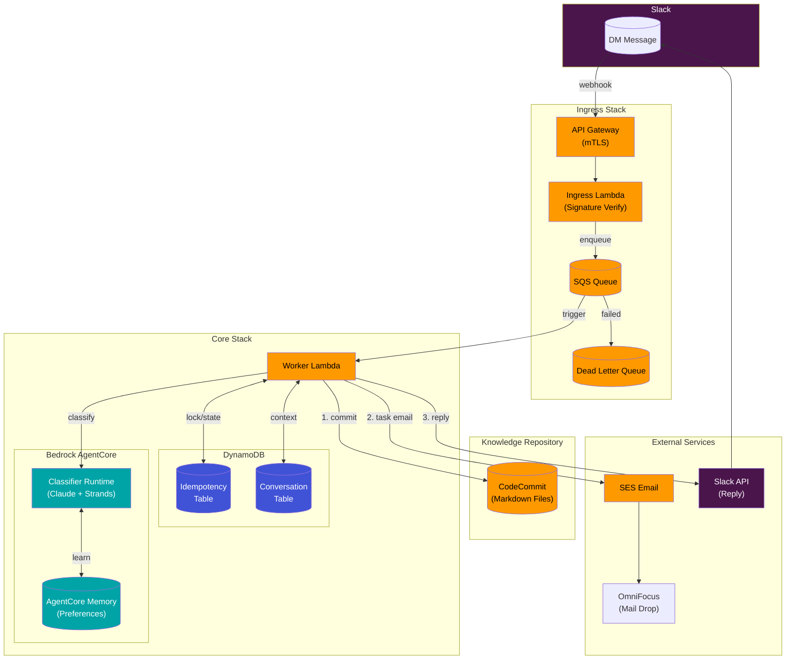

# Second Brain Agent

> A personal knowledge capture system that turns Slack DMs into organized notes, decisions, and tasks.

[]()
[]()
[]()
[]()

Send a message to your Slack bot, and it automatically:
- **Classifies** your thought (inbox, idea, decision, project, or task)
- **Stores** it in a Git repository as Markdown
- **Routes** tasks to OmniFocus via email
- **Confirms** what it did

No apps to open. No forms to fill. Just message your bot.

## Demo

```
You: I've decided to use PostgreSQL for the new project because of 
     better JSON support and our team's familiarity with it.

Bot: ✓ Captured as decision
     File: 20-decisions/2024-01-15-use-postgresql.md
     Commit: a1b2c3d
     
     Reply "fix: <instruction>" to make changes.
```

## How It Works



### Processing Flow

1. **Ingress** - Slack webhook → API Gateway (mTLS) → Lambda (HMAC verify) → SQS
2. **Idempotency** - Worker acquires lock in DynamoDB, prevents duplicate processing
3. **Classification** - AgentCore Runtime (Claude) determines intent and category
4. **Side Effects** - Execute in order with partial failure recovery:
   - Git commit to CodeCommit (ideas, decisions, projects, inbox)
   - Email via SES (tasks → OmniFocus)
   - Reply via Slack API (confirmation)
5. **Learning** - AgentCore Memory stores user preferences from corrections

## Classification

| Type | Description | Example | Destination |
|------|-------------|---------|-------------|
| **inbox** | Quick notes, reminders | "Remember to call John" | `00-inbox/YYYY-MM-DD.md` |
| **idea** | Insights, concepts | "What if we cached API responses?" | `10-ideas/YYYY-MM-DD__<slug>__<sb-id>.md` |
| **decision** | Choices made | "Going with React for the frontend" | `20-decisions/YYYY-MM-DD__<slug>__<sb-id>.md` |
| **project** | Multi-step work | "Starting the Q2 marketing campaign" | `30-projects/YYYY-MM-DD__<slug>__<sb-id>.md` |
| **task** | Actionable items | "Need to review the PR today" | OmniFocus (via email) |

Ideas, decisions, and projects include:
- **SB_ID** - Unique identifier (`sb-a7f3c2d`) for linking between notes
- **Front Matter** - YAML metadata with id, type, title, created_at, tags
- **Auto-extracted Tags** - 2-4 tags derived from content

## Features

- **Smart Classification** - AI-powered categorization with confidence scoring
- **Clarification Flow** - Asks when uncertain, remembers context
- **Fix Command** - Correct mistakes with `fix: change the title to...`
- **Git-Backed Storage** - Full history, diffable, portable Markdown
- **OmniFocus Integration** - Tasks go straight to your task manager
- **Idempotent Processing** - Safe retries, exactly-once semantics
- **Partial Failure Recovery** - Resumes from where it left off

## Quick Start

### Prerequisites

- Node.js 20+
- AWS CLI configured
- Slack workspace (admin access)

### Deploy

```bash
# Clone and install
git clone https://github.com/yourusername/second-brain-agent
cd second-brain-agent
npm install

# Configure secrets (choose your security mode)
./scripts/setup-ssm.sh --mode mtls-hmac    # Most secure (default)
./scripts/setup-ssm.sh --mode mtls-only    # mTLS only
./scripts/setup-ssm.sh --mode hmac-only    # Simplest setup

# Deploy
./scripts/deploy.sh --mode mtls-hmac --sender-email you@example.com
```

### Security Modes

| Mode | Security | Requirements |
|------|----------|--------------|
| `mtls-hmac` | Highest | Custom domain + ACM cert + Signing secret |
| `mtls-only` | High | Custom domain + ACM cert |
| `hmac-only` | Standard | Signing secret only (Lambda Function URL) |

### Configure Slack

1. Create a Slack app at [api.slack.com/apps](https://api.slack.com/apps)
2. Add bot scopes: `chat:write`, `im:history`, `im:read`, `im:write`
3. Install to workspace, copy bot token
4. Enable Event Subscriptions with your Lambda URL
5. Subscribe to `message.im` events

See [Complete Setup Guide](./docs/SETUP.md) for detailed instructions.

## Usage

### Basic Messages

```
Remember to water the plants
```
→ Goes to inbox

```
I've decided to switch to TypeScript
```
→ Creates decision note

```
I need to call the dentist tomorrow
```
→ Sends to OmniFocus

### Fix Mistakes

```
fix: change the title to "TypeScript Migration Decision"
```

### Clarification

When the agent is unsure:
```
Bot: I'm not sure how to classify this. Is this an idea, decision, or task?
You: idea
Bot: ✓ Captured as idea...
```

## Architecture

### Stacks

| Stack | Resources |
|-------|-----------|
| **IngressStack** | Lambda, SQS Queue, DLQ, (mTLS modes: API Gateway, Route 53, S3 truststore) |
| **CoreStack** | Worker Lambda, DynamoDB (2), CodeCommit, ECR, CodeBuild, AgentCore Runtime, SES |

### Security Modes

- **mtls-hmac** (default): API Gateway with mTLS + HMAC signature verification
- **mtls-only**: API Gateway with mTLS only (Slack client cert validation)
- **hmac-only**: Lambda Function URL with HMAC signature verification

### Key Design Decisions

- **Configurable Security** - Three modes: mTLS+HMAC (production), mTLS-only, HMAC-only (dev)
- **API Gateway with mTLS** (default) - Validates Slack client certificates for defense in depth
- **SQS** for async processing - Slack requires <3s response, processing takes longer
- **DynamoDB** for idempotency - conditional writes prevent duplicate processing
- **CodeCommit** over S3 - Git history, branch/merge capability, familiar tooling
- **AgentCore** over direct Bedrock - managed runtime, built-in observability

## Configuration

### SSM Parameters (Secrets)

| Parameter | Description | Required For |
|-----------|-------------|--------------|
| `/secondbrain/ingress/security_mode` | Security mode | All |
| `/second-brain/slack-signing-secret` | Webhook HMAC verification | mtls-hmac, hmac-only |
| `/second-brain/slack-bot-token` | API authentication | All |
| `/second-brain/omnifocus-maildrop-email` | Task routing | All |
| `/secondbrain/ingress/domain_name` | Custom domain | mtls-hmac, mtls-only |
| `/secondbrain/ingress/hosted_zone_id` | Route 53 zone | mtls-hmac, mtls-only |
| `/secondbrain/ingress/acm_cert_arn` | TLS certificate | mtls-hmac, mtls-only |

### CDK Context

| Key | Description | Default |
|-----|-------------|---------|
| `senderEmail` | SES sender address | `noreply@example.com` |
| `securityMode` | Ingress security mode | `mtls-hmac` |
| `classifierModel` | Bedrock model for classification | `amazon.nova-micro-v1:0` |

### Model Selection

The classifier model can be configured at deploy time for cost/capability tradeoffs:

```bash
# Use default (Nova Micro - cheapest)
npx cdk deploy SecondBrainCoreStack

# Use Claude Haiku (better quality, higher cost)
npx cdk deploy SecondBrainCoreStack -c classifierModel=anthropic.claude-3-5-haiku-20241022-v1:0

# Use Nova Lite (balanced)
npx cdk deploy SecondBrainCoreStack -c classifierModel=amazon.nova-lite-v1:0
```

| Model | Model ID | Input/1M | Output/1M | Notes |
|-------|----------|----------|-----------|-------|
| Nova Micro | `amazon.nova-micro-v1:0` | $0.035 | $0.14 | Default, fastest, cheapest |
| Nova Lite | `amazon.nova-lite-v1:0` | $0.06 | $0.24 | Good balance |
| Claude 3.5 Haiku | `anthropic.claude-3-5-haiku-20241022-v1:0` | $0.80 | $4.00 | Best quality |

### Environment Variables

| Variable | Description | Default |
|----------|-------------|---------|
| `EMAIL_MODE` | `live` or `log` | `live` |

## Development

### Run Tests

```bash
npm test                          # All tests
npm test -- --run test/unit/      # Unit tests only
npm test -- --run test/property/  # Property tests only
```

### Synthesize CDK

```bash
npx cdk synth
npx cdk diff
```

### Project Structure

```
.
├── agent/                  # Python classifier (AgentCore)
├── docs/                   # Documentation
├── lib/                    # CDK stacks
├── scripts/                # Deployment scripts
├── src/
│   ├── components/         # Business logic
│   ├── handlers/           # Lambda handlers
│   └── types/              # TypeScript types
├── system/                 # System prompt
└── test/
    ├── cdk/                # Infrastructure tests
    ├── integration/        # Flow tests
    ├── property/           # Property-based tests
    └── unit/               # Unit tests
```

## Documentation

- [Complete Setup Guide](./docs/SETUP.md) - Step-by-step installation
- [Usage Guide](./docs/USAGE.md) - How to use effectively
- [Troubleshooting](./docs/TROUBLESHOOTING.md) - Common issues

## Cost Estimate

For personal use (~100 messages/day):

| Service | Estimated Monthly Cost |
|---------|----------------------|
| Lambda | ~$0 (free tier) |
| DynamoDB | ~$0 (free tier) |
| SQS | ~$0 (free tier) |
| CodeCommit | ~$0 (free tier) |
| AgentCore/Bedrock (Nova Micro) | ~$0.50 |
| SES | ~$0.10 |
| **Total** | **~$1/month** |

*Using default Nova Micro model. Claude Haiku would be ~$5-10/month.*

## Contributing

Contributions welcome! Please:

1. Fork the repository
2. Create a feature branch
3. Add tests for new functionality
4. Ensure all tests pass
5. Submit a pull request

## License

MIT - see [LICENSE](./LICENSE) for details.

---

Built with [AWS CDK](https://aws.amazon.com/cdk/), [Bedrock AgentCore](https://aws.amazon.com/bedrock/), and [Strands Agents](https://github.com/strands-agents/strands-agents).
